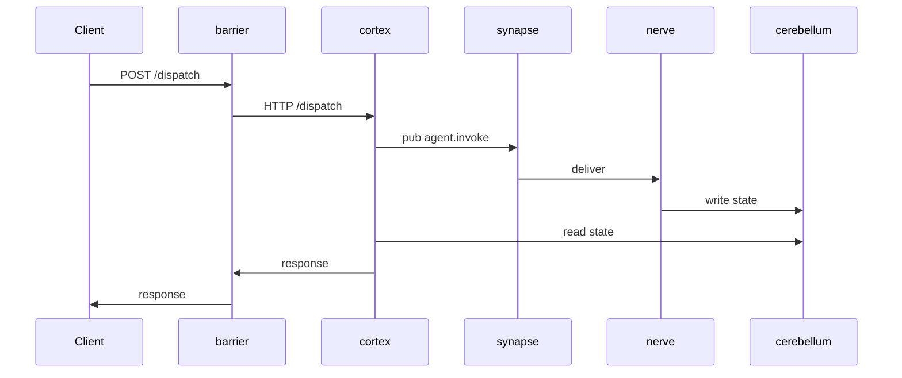

# Product Analysis Plan

Detailed checklist for what to analyze and what to write in `docs/ARCHITECTURE.md`.

---

## Phase 1: Inventory

For each repo (subdirectory) in cwd:

```bash
# List repos
for d in */; do
  [ -d "$d/.git" ] || [ -f "$d/pyproject.toml" ] || [ -f "$d/package.json" ] || [ -f "$d/go.mod" ] && echo "$d"
done
```

For each detected repo, collect (read but don't edit):
- `README.md` (top 50 lines)
- `pyproject.toml` / `package.json` / `go.mod` / `Cargo.toml` (full)
- `Dockerfile` (full)
- Entry point file (e.g. `src/main.py`, `cmd/server/main.go`, `src/index.ts`)
- `.env.example` (full)
- `docker-compose.yml` if present
- `.gitlab-ci.yml` / `.github/workflows/*.yml` (high-level)

---

## Phase 2: Per-repo fingerprint

For each repo, derive:

| Attribute | Where to look |
|---|---|
| Language + version | manifest |
| Framework | manifest deps (FastAPI / Gin / Express / etc.) |
| Service type | classify: gateway / orchestrator / worker / store / lib |
| Default port | Dockerfile EXPOSE / config / env defaults |
| Health endpoint | grep `/health` / `/healthz` / `/readyz` in code |
| External deps (network) | grep `httpx.AsyncClient` / `requests.get` / `fetch(` / `nats.connect` / `kafka.Producer` / `grpc.client` |
| Database client | grep `asyncpg` / `psycopg` / `sqlalchemy` / `redis` / `mongo` / `clickhouse` |
| Message bus client | grep `nats` / `aiokafka` / `confluent-kafka` / `pika` (rabbitmq) |
| Internal RPC | grep `grpc` / specific shared client lib |
| Auth | grep `jwt` / `oauth` / `bearer` / specific lib |

Output per repo:
```yaml
repo: barrier
language: Python 3.11
framework: FastAPI 0.110
service_type: gateway
port: 8080
health: /health
external_calls:
  - cortex (HTTP via httpx, localhost:8001 hint)
  - cerebellum (HTTP via httpx, localhost:8002)
db_client: none
mq_client: none
auth: JWT bearer + Redis blacklist
```

---

## Phase 3: Build communication graph

Cross-reference per-repo `external_calls` with sibling repos' declared ports.

Output: communication table.

```
Source → Target | Protocol | Endpoints / Topics
barrier → cortex | HTTP/REST (httpx async) | POST /dispatch, GET /status
cortex → synapse | NATS pub-sub | publishes: agent.invoke
nerve → synapse | NATS subscribe | subscribes: agent.invoke
nerve → cerebellum | HTTP/REST | POST /state
vox → cortex | HTTP/REST | POST /callback
```

External services (outside the product):
```
* → Postgres | localhost:5432 (dev-stack)
* → Redis | localhost:6379 (dev-stack)
```

---

## Phase 4: Data flow analysis

For 1-3 main user-facing flows, write a sequence diagram in text:

```
### Main flow: POST /dispatch
1. Client → barrier (auth, validate, rate-limit)
2. barrier → cortex (HTTP /dispatch)
3. cortex → synapse (publish agent.invoke)
4. nerve subscribes → processes → publishes agent.complete
5. cortex polls cerebellum for state
6. cortex → barrier (response)
7. barrier → Client
```

Use mermaid sequence diagrams if user prefers visual:


---

## Phase 5: Tech stack distribution

Table:

| Service | Language | Framework | Runtime | DB | MQ |
|---|---|---|---|---|---|
| barrier | Python 3.11 | FastAPI | uvicorn | — | — |
| cortex | Python 3.11 | FastAPI | uvicorn | — | NATS |
| nerve | Python 3.11 | — | python -m | — | NATS |
| synapse | Go 1.22 | — | go binary | — | NATS broker |
| cerebellum | Go 1.22 | chi | go binary | Postgres | — |
| vox | Python 3.11 | FastAPI | uvicorn | — | — |

---

## Phase 6: Deployment topology

From `Dockerfile`, CI configs, k8s manifests:

```
Build: GitLab CI builds Docker images, pushes to GitLab Registry
Deploy: <TODO infer from k8s manifests if present, ask user otherwise>
Orchestration: Kubernetes / Docker Compose / Nomad / bare metal
Environments: dev (local), staging (auto-deploy from dev branch), prod (manual release from main)
```

If can't infer — leave as TODO with concrete questions for user.

---

## Phase 7: Architectural patterns

Identify patterns observed:

- **Event-driven via NATS** — agent work goes async through synapse
- **Centralized state** — cerebellum is single source of truth
- **API gateway** — barrier is sole external entry point
- **Polyglot** — Python for IO-bound services, Go for high-throughput
- **Service mesh не используется** — direct HTTP calls between services
- (...other patterns)

---

## Phase 8: Candidate ADRs

When analysis surfaces non-trivial design decisions, propose ADRs:

```
Proposed ADRs:
1. 0001-message-bus-via-nats.md — why NATS (not Kafka/Rabbit/SQS)
2. 0002-state-centralized-in-cerebellum.md — why one service holds state
3. 0003-no-service-mesh.md — direct HTTP without Istio/Linkerd
4. 0004-polyglot-python-go.md — language choice rationale
```

Each ADR file structure (Michael Nygard format):
```markdown
# 0001. Message bus via NATS

## Status
Accepted (2024-12)

## Context
We need async work distribution from cortex to multiple agent workers.
Options considered: Kafka, RabbitMQ, NATS, SQS, Redis pub-sub.

## Decision
Use NATS via synapse service as central message broker.

## Consequences
+ Lightweight, low latency
+ Single binary, easy ops
- No durable storage by default (use NATS JetStream if needed later)
- Lock-in to NATS-specific patterns

## Status history
- 2024-12 Accepted
```

If real decision context is unknown — write ADR with `Context: TODO confirm with team`
to mark for human follow-up.

---

## Phase 9: Output

Write all of above to `docs/ARCHITECTURE.md` in this structure:

```markdown
# Architecture — ${PROD}

## Overview
<1-2 paragraphs synthesized from Phase 1-2>

## Services
<one section per repo with Phase 2 attributes>

## Inter-service communication
<Phase 3 table + per-pair details>

## Data flow
<Phase 4 sequence diagrams>

## Tech stack distribution
<Phase 5 table>

## Deployment
<Phase 6>

## Architectural patterns
<Phase 7 list>

## Decisions (ADRs)
See `docs/adr/`:
<list from Phase 8>

## Known issues / non-obvious
<from code analysis: deprecated patterns, TODO comments в коде, etc.>
```

Then propose ADR files separately (Phase 8 output).

---

## Limits and caveats — communicate to user

- **Code analysis is heuristic.** Pattern detection works for common frameworks
  but may miss non-standard usage. Mark uncertainty explicitly.
- **External services beyond cwd** may be invisible. If repo calls `https://api.external.com`,
  note it but ask user to confirm what service that is.
- **Async patterns** harder than sync to trace. Ask user for clarification on
  ambiguous flows.
- **Don't fabricate.** If can't find — write `TODO confirm with user` not guess.
